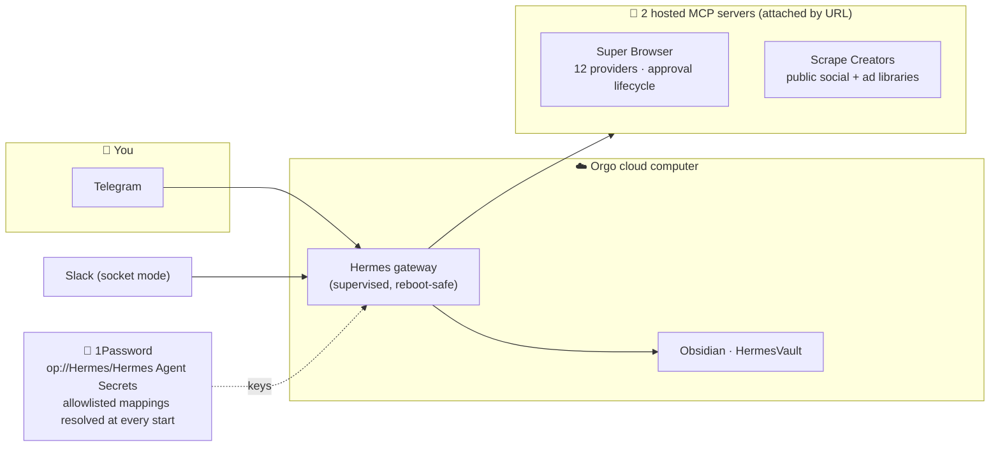

<div align="center">


# Revenue Partner

### Practical AI for revenue, operations, and everyday life.

One calm, always-available operator that helps you find opportunities, stay on
top of follow-up, prepare proposals, organize the work, and protect your time.

[**Install Revenue Partner →**](START-HERE.md) &nbsp;·&nbsp;
[See the Slack walkthrough](docs/SLACK-SETUP.md) &nbsp;·&nbsp;
[Explore the tools](docs/TOOLS.md)

</div>

<div align="center">

[](https://github.com/jbellsolutions/revenue-partner-agent/actions/workflows/ci.yml)
[](docs/VERIFICATION.md)
[](https://github.com/NousResearch/hermes-agent)
[](docs/SLACK-SETUP.md)
[](#-whats-in-the-box)
[](#-your-keys-stay-yours)
[](LICENSE)

</div>

---

## AI should make life lighter

Revenue Partner is the revenue-and-operations side of **The AI Guy** approach:
use practical AI to remove busywork, keep the important work moving, and give
people more room to think, sell, serve customers, and live their lives.

It is not another dashboard to babysit. It is an operator you can talk to in
plain language from Slack.

<table>
<tr>
<td width="33%" valign="top">

### Grow revenue

Find and qualify opportunities, coordinate outreach and partner channels, keep
follow-up moving, prepare proposals, and report the numbers that matter.

</td>
<td width="33%" valign="top">

### Run operations

Work across inboxes, calendars, documents, CRM, research, tasks, skills, and
repeatable workflows without living in a dozen tabs.

</td>
<td width="33%" valign="top">

### Get time back

Turn scattered requests into a clear plan, protect personal time, remember the
details, and finish the day knowing what moved forward.

</td>
</tr>
</table>

<div align="center">

</div>

---

## One partner for the work that keeps piling up

Once you authorize the tools you want, Revenue Partner can help you:

- mine and qualify leads across the channels your buyers already use;
- recover old demand and coordinate targeted outbound;
- organize affiliate, partner, speaker, sponsor, and content opportunities;
- read calendars and inboxes, prepare the next action, and keep follow-up clear;
- create private proposal drafts and track document status;
- maintain one Money Desk for booked, attended, qualified, pipeline, and closed revenue;
- research, write, organize files, manage tasks, and schedule recurring work;
- remember your business context and load specialist skills only when needed.

Revenue Partner drafts and researches freely inside its private workspace.
Sending, publishing, spending, changing customer records, inviting people, or
launching a campaign stays behind an explicit approval step.

---

## From a GitHub link to a working Slack partner

The recommended installation is designed for a first-time owner and for a live
webinar. It uses a private Ubuntu VPS, the reviewed Hermes Agent 0.20.6 image,
and Slack's current Agent view.

1. Give the repository link to Codex or Claude Code.
2. The setup agent prepares the server and installs Revenue Partner.
3. You approve the account sign-ins and paste private values into hidden prompts.
4. The installer creates the Slack app, connects the tools you choose, and tests
   a real direct message and channel thread.

No public webhook is needed. No private token belongs in GitHub. The walkthrough
explains one screen and one decision at a time.

### Start here

Give your setup agent this repository:

```text
https://github.com/jbellsolutions/revenue-partner-agent
```

Then tell it:

```text
Install Revenue Partner for me. Read START-HERE.md first, handle every technical
step, and walk me through only the account approvals and private values you need.
Finish when Revenue Partner answers a real message in Slack.
```

Or run the guided installer on a fresh Ubuntu VPS:

```bash
git clone https://github.com/jbellsolutions/revenue-partner-agent.git
cd revenue-partner-agent
./deploy/setup.sh
```

### Everything needed for the walkthrough

| Guide | What it covers |
|---|---|
| [Start Here](START-HERE.md) | The plain-language installation from beginning to done |
| [Slack setup](docs/SLACK-SETUP.md) | Every Slack screen, token, permission, command, and real-message test |
| [Tools](docs/TOOLS.md) | Calendar, inbox, files, CRM, business apps, and PandaDoc proposals |
| [Skills](docs/SKILLS.md) | Included specialist skills, approvals, audits, and safe updates |
| [Updates](docs/UPDATES.md) | The reviewed runtime and repeatable update process |

---

## What comes with it

| Layer | Included |
|---|---|
| **Revenue Partner brain** | Fit gates, approved claims, offer and ICP context, campaign rules, operating procedures, and Money Desk reporting |
| **Private home** | An always-on VPS with persistent memory, files, skills, and configuration |
| **Conversation** | Slack Agent view, direct messages, threaded channel work, buttons, and 50 current native commands |
| **Everyday tools** | Research, browser, files, documents, code, vision, images, tasks, schedules, memory, and delegation when their prerequisites are available |
| **Business connections** | Guided Composio connection for Calendar, Gmail, Outlook, Drive, CRM, and other apps, plus global or European PandaDoc |
| **Skill system** | Revenue Partner operating skill, browser specialists, the bundled Hermes catalog, security scans, audits, updates, and owner-reviewed skill changes |
| **Safety** | Slack Member-ID allowlist, hidden secret entry, private storage, untrusted external connectors, read-only first tests, and approval before consequential writes |

The deterministic Orgo template remains available and unchanged as an advanced,
legacy release path. The beginner Slack installation is additive and does not
rewrite that working release.

---

## The Revenue Partner operating system

This is more than a renamed assistant. It carries a source-grounded GTM
execution contract built around:

- **Two demand engines:** owned-demand recovery and new-demand acquisition.
- **Four coordinated channels:** affiliates/partners, direct outbound, reactivation, and social/content.
- **Four readiness pillars:** architecture, data, infrastructure, and execution.
- **Phased execution:** fit/map → architecture/story → infrastructure/data → launch → run/report/optimize.
- **Money Desk reporting:** booked, attended, qualified, opportunity, pipeline, and closed revenue stay separate.

### What it actually does

The model above is the frame. These are the jobs, and the tool that runs each one.

**Lead mining — the core job.** This began as a lead-mining and posting system and
still is one. Mine candidates from communities and platforms, qualify on real
engagement signals, enrich contacts off-platform, post back under approval.
Primary sources: **Skool groups**, Facebook groups, LinkedIn, Instagram, TikTok,
YouTube, Reddit, Craigslist and Marketplace. Oversample 3–5×; no single source
has everything, so merge and deduplicate across them.

**Affiliates and influencers**
- Find affiliate/influencer candidates across Instagram, TikTok, YouTube, LinkedIn and Reddit
- Pull each candidate's most-engaged recent posts
- Extract the people commenting on those posts — self-selected warm leads, captured with provenance
- Comment on candidate posts to earn attention, and DM/outreach to recruit them
- Run the affiliate program itself through the cold-email stack

**Classifieds and marketplace**
- Post ads to Craigslist and Facebook Marketplace from the operator's own logged-in profile
- Post into Facebook groups on a saved-cookie profile
- Scrape Craigslist listings for leads without logging in
- Poll replies to every posted ad from the same profile that posted it

**Email**
- Launch cold campaigns, classify incoming replies, and draft responses for approval

Sourcing and scraping run on public routes with no login. Posting runs on the
operator's own accounts with immutable audit records and idempotency keys, so a
retry never double-posts. Comments disclose affiliation. There is no detection
evasion anywhere — no proxy rotation, fingerprint spoofing, or CAPTCHA solving.

Campaign launch, Gmail send, paid spend and bulk CRM mutation stay
approval-gated, because those are the actions whose blast radius is not
recoverable by re-posting.
- **SpeakerAgent Riley:** discovers/scores podcasts, stages, conferences, seminars, and sponsor opportunities; a human owns relationships and closing.
- **Human approval policy:** SOUL.md and the Revenue Partner skill require an approved campaign contract covering audience, source, sender, claims, volume, schedule, spend, suppression, CRM, pause, and stop bounds. Hard runtime gating is implemented in Super Browser and the AgentPhone bridge; other integrations remain governed by operator/tool permissions rather than a claimed universal campaign-record gate.
- **Source integrity:** the `2–4 booked meetings/day` statement is represented as a target, never a guarantee or typical result.
- **Persistent context:** a seeded `/root/agent-knowledge` vault holds fit, offer, ICP, approved claims, Money Desk mapping, campaigns, and reports.
- **Super Browser:** one provider-neutral MCP front door with eight adapters and build-time Playwright policy/fixture-wiring verification; real browser launch remains an image-build live-smoke gate.

Canonical files:

- `files/SOUL.md`
- `files/skills/go-to-market/revenue-partner/SKILL.md`
- `files/skills/go-to-market/revenue-partner/references/source-ledger.md`
- `files/skills/go-to-market/revenue-partner/references/campaign-contract.md`
- `files/agent-knowledge/INDEX.md`

### Documentation

| Guide | Covers |
|---|---|
| [Beginner installation](START-HERE.md) | Current VPS and Slack setup from a single repository link |
| [Slack setup](docs/SLACK-SETUP.md) | Exact app-manifest, token, allowlist, channel, and test sequence |
| [Skills](docs/SKILLS.md) | Included Revenue Partner skills, Hermes Skills Hub, approvals, audits, and updates |
| [Tools](docs/TOOLS.md) | Full current toolset and guided Calendar, inbox, app, and proposal connections |
| [Updates](docs/UPDATES.md) | Reviewed runtime pin, current features, and safe container/manifest refresh |
| [Documentation index](docs/README.md) | Complete public documentation map |
| [Architecture](docs/ARCHITECTURE.md) | Components, data flow, trust boundaries, and extension rules |
| [Operator guide](docs/OPERATOR_GUIDE.md) | Fit, Money Desk, campaign approvals, operation, and reporting |
| [Deployment](docs/DEPLOYMENT.md) | Local validation, Orgo publication/build/launch, and live smoke |
| [Security model](docs/SECURITY_MODEL.md) | Secrets, approvals, bridges, provider gates, and known limits |
| [Supply chain](docs/SUPPLY_CHAIN.md) | Hash locks, exact artifact pins, checksum verification, regeneration, and platform trust limits |
| [Source grounding](docs/SOURCE_GROUNDING.md) | Source URLs, claim classes, evidence limits, and prohibited inference |
| [Verification](docs/VERIFICATION.md) | Exact release evidence and current deployment status |
| [Contributing](CONTRIBUTING.md) | Development, testing, and review requirements |
| [Security policy](SECURITY.md) | Private vulnerability reporting |

> **Release identity:** this source snapshot is the `1.0.1` candidate, but repository files do not establish whether a GitHub tag/release or Orgo publication/build/launch exists. Determine live status through remote readback. A pre-release authenticated Orgo check accepted the schema but found the workspace lacked template-publishing entitlement; that historical result is neither publication nor a current entitlement claim.

Build and test:

```bash
REVENUE_PARTNER_VERIFY_PYTHON=/absolute/path/to/trusted/python3.11 bash .github/scripts/verify_release
```

For authenticated validation, publication/build, and launch, follow the lock-backed safe-environment commands in the [deployment guide](docs/DEPLOYMENT.md). Do not source credential files or invoke the builder from an ambient dependency environment.

---

## ✨ What it feels like

You launch a cloud desktop. A setup window signs you into the model, you scan a QR with your phone, tap **Create Bot** — and now there is a Revenue Partner on Telegram with local notes and constrained public-read research. AgentPhone alone ships as non-executable reference source, Latitude ships as optional observability, and the other writable connectors listed below are absent from the runtime:

- 💬 **chats with you on Telegram** after operator onboarding
- 🚫 **does not currently send SMS/iMessage or email** — AgentPhone reference source is hard-stopped; AgentMail runtime/client are absent
- 🚫 **does not currently spend or mutate connected apps** — AgentCard and Composio runtime registrations/clients are absent
- 🚫 **does not operate other Orgo computers** — the Orgo connector, Desktop plugin, client, and CLI are absent
- 📝 **keeps notes** in an Obsidian vault you can open right on its desktop
- 🔭 **supports full observability when configured** — Latitude can trace model and tool calls after credentials are connected
- 🔐 **fetches its own keys** from a 1Password vault you control

<div align="center">

<br/><em>First boot — the guided setup walks you through model sign-in, the Telegram QR, and 1Password.</em>
</div>

---

## 🗺️ How it's wired



Slack is retained and operator-enabled; what the agent may DO over Slack is bounded by `platform_toolsets`, not by removing the platform. The other named production connectors in the capability table are absent, hard-stopped reference source, or removed by the exact-version image-build pruner. Their credentials are rejected and cannot activate them from a key, login, flag change, restart, approval record, chat request, or agent action. Operator-controlled source/configuration changes, complete verification, a fresh exact-tree review, a rebuilt image, and a new release are required. Enabled read/planning services remain key-less or dormant when unconfigured.

---

## 🟢 Legacy Orgo cloud-desktop path

1. **Make an Orgo account** → [orgo.ai](https://orgo.ai).
2. **Publish and launch your copy** using the verified workflow in [Deployment](docs/DEPLOYMENT.md). This repository does not currently claim a gallery entry.
3. The **Revenue Partner Setup** window walks you through:
   - **Connect a model** — `hermes auth add openrouter --type api-key` and you're done; the default is `anthropic/claude-sonnet-5` via OpenRouter. This is a plain API key, so the agent can be brought up headlessly with no desktop session. Nous device-code OAuth remains available but needs an interactive sign-in.
   - **Scan the QR** → tap **Create Bot** in Telegram → your personal bot is live. 🎉
   - **Optional: paste a 1Password service-account token** — it resolves only the narrow model, Telegram, and telemetry allowlist; absent/non-executable connector credentials are excluded.
4. **Text your bot.** You're done.

<details>
<summary><b>Absent/non-executable connector inventory — future separately reviewed integrations</b></summary>

| Surface | Current release status |
|---|---|
| Slack | **Enabled** — socket mode, operator-connected. Workspace scopes govern visibility; `platform_toolsets` governs what the agent can do |
| Scrape Creators | **Enabled** — hosted MCP, public-data routes only; no login, cookies, or authenticated profile |
| 1Password secret transport | Optional operator setup; resolving a secret never activates a disabled connector |
| Composio | Runtime registration and client absent; a separately reviewed integration/rebuild/release is required |
| AgentMail | Runtime registration and client absent; a separately reviewed integration/rebuild/release is required |
| AgentCard | Runtime registration absent; OAuth cannot be initiated by this release |
| AgentPhone | MCP/client absent; packaged reference source has immutable main/job/server/tunnel/API/send hard stops |
| Latitude | Optional observability only; no content captured by default; operator verification required |
| Orgo connector | Runtime registration and CLI absent; publication/build/launch occur only through the separate release workflow |
| Linear | Runtime registration absent; a separately reviewed integration/rebuild/release is required |
| External memory | Runtime registration absent; local files remain the memory surface |

**1Password convention:** vault **`Hermes`** → Secure Note **`Hermes Agent Secrets`** → only the allowlisted model, Telegram, and optional Latitude fields present in `config.yaml`. Absent/non-executable connector credentials are intentionally excluded. The service account only needs read access to that one vault.

</details>

---

## 📦 What's in the box

| | |
|---|---|
| **Agent** | Recommended VPS: Hermes Agent 0.20.6 in a digest-pinned official image. Legacy Orgo template: Hermes Agent 0.18.0 in its original hash-locked runtime |
| **Chat** | Slack (socket mode) and optional Telegram QR onboarding, both operator-configured |
| **Secrets** | Runtime-only environment/secret-manager inputs; no credential values are embedded in the template |
| **Browser** | Hosted Super Browser MCP, **attached by URL, never vendored** — 12 providers (Playwright, Browser Use, Airtop, Hyperbrowser, Steel, Browserbase, Orgo desktop, Decodo, four Bright Data lanes) with Apify actor routing, persistent browser profiles, and the full approval lifecycle running server-side |
| **Phone** | AgentPhone future-integration reference source only; all executable entrypoints and concrete network/send boundaries are hard-stopped |
| **Tracing** | Optional Latitude telemetry when configured and verified |
| **Skills** | Curated Revenue Partner operating skill and references, bundled current Hermes catalog, Super Browser specialists, Skills Hub search/install/update/audit, and optional skill-write approval |
| **Persona** | Revenue Partner SOUL.md with fit gates, claim discipline, and approval boundaries |
| **Knowledge** | Operator-controlled company, ICP, claims, permissions, campaign, and reporting vault |

---

## 🔐 Your keys stay yours

The template declares no credential values. Keys belong only in the operator's runtime environment (`~/.hermes/.env` / `~/.hermes/.op.env`) or configured secret manager. Release verification scans exact candidate-tree blobs after the non-Python launcher exports one immutable Git-index tree; never commit generated launch files or dotenv files.

---

## 🛠️ Run your own copy

Publishing and building require an Orgo account with template-build access; the authenticated API currently requires Scale or higher for publication. First run the exact locked release matrix. Then bridge only the allowlisted external credentials into the lock-backed command without sourcing shell code:

```bash
REVENUE_PARTNER_VERIFY_PYTHON=/absolute/path/to/trusted/python3.11 bash .github/scripts/verify_release
uv venv --python /absolute/path/to/trusted/python3.11 .artifacts/release-venv
uv pip sync --python .artifacts/release-venv/bin/python --require-hashes requirements-ci.lock
LOCKED_RELEASE_PY="$PWD/.artifacts/release-venv/bin/python"
"$LOCKED_RELEASE_PY" -I -s -E files/safe-env-bridge.py \
  --source /absolute/path/to/revenue-partner.env \
  --target /tmp/revenue-partner.env \
  --only ORGO_API_KEY \
  --only REVENUE_PARTNER_REVIEW_ATTESTATIONS \
  --only REVENUE_PARTNER_OPERATION_INTENT_DIRECTORY \
  --only REVENUE_PARTNER_NONCE_LEDGER \
  --exec env -u VIRTUAL_ENV -u PYTHONPATH \
  "$LOCKED_RELEASE_PY" -I -s -E \
    release_entry.py --build --launch 'WORKSPACE_ID'
```

Replace `'WORKSPACE_ID'` with the literal non-secret workspace ID. Omit `--launch 'WORKSPACE_ID'` to stop after a ready build. Launch cannot run as a later standalone command: it must consume the validated immutable `namespace/name@version` reference and content digest returned by the successful publish in that same process.

<details>
<summary><b>Make it yours — what's in <code>files/</code></b></summary>

- `config.yaml` — the Hermes config (2 configured/enabled hosted MCP servers — Super Browser and Scrape Creators — 9 enabled model/telemetry plugins, per-platform toolsets, and the narrow 1Password map)
- `SOUL.md` — the agent's personality
- `onboard.sh` / `telegram-pair.py` / `op-enable.py` — the first-boot setup
- `agentphone-bridge/` — reviewed future-integration source; supervisor entrypoint and direct network helpers are hard-stopped
- `local-packages/latitude-telemetry-hermes/` — the Latitude telemetry plugin, registered directly in the locked Hermes venv with standard-library-written `.pth` and `.dist-info` metadata
- `skills/`, `agent-knowledge/` — the curated Revenue Partner skill and operator-controlled knowledge vault

Edit those, bump the `VERSION` constant, rerun `REVENUE_PARTNER_VERIFY_PYTHON=/absolute/path/to/trusted/python3.11 bash .github/scripts/verify_release`, and then use the lock-backed safe-environment publication command in the [deployment guide](docs/DEPLOYMENT.md).

`build_template.py` drives the full **publish → reference/digest readback → reference/digest build → reference-bound event stream → optional readback-gated reference/digest launch** flow against the Orgo REST API (the `orgo` CLI has no template commands — REST is the path). It rejects empty/mismatched 2xx responses, version collisions, stale friendly references, oversized response bodies, unbound build events, and unbounded build-event streams. The big file trees ship inside one deterministic base64 tarball — the publish endpoint caps the request body around 1 MB.

</details>

---

## ❓ FAQ

<details><summary><b>Do I need to code?</b></summary>
No — the launch + QR flow is point-and-click. Coding only matters if you want to <em>modify</em> the template.
</details>

<details><summary><b>Where do my keys go?</b></summary>
Only onto your own VM (or your own 1Password vault). This repo and the template contain none.
</details>

<details><summary><b>The model says it needs access?</b></summary>
The default is <code>anthropic/claude-sonnet-5</code> through OpenRouter, so make sure that account has credit. Any OpenRouter-reachable model works — change <code>model.default</code> in <code>config.yaml</code>. Nous (<code>hermes auth add nous --type oauth</code>) and OpenAI (<code>hermes auth add openai-codex</code>) are still supported.
</details>

<details><summary><b>Why is 1Password off until I paste a token?</b></summary>
Without a token, the <code>op</code> CLI prompts interactively on every start — so the map ships disabled and flips on automatically the moment your token lands.
</details>

<details><summary><b>Can I change the personality or model?</b></summary>
Yes — edit <code>SOUL.md</code> / <code>config.yaml</code> and rebuild (or just tell the agent).
</details>

---

<div align="center">

MIT licensed · Hermes Agent by [Nous Research](https://github.com/NousResearch/hermes-agent) · cloud computers by [Orgo](https://orgo.ai)

*Built from reusable agent infrastructure; Revenue Partner deployment and runtime evidence are verified separately for each published version.*

</div>
