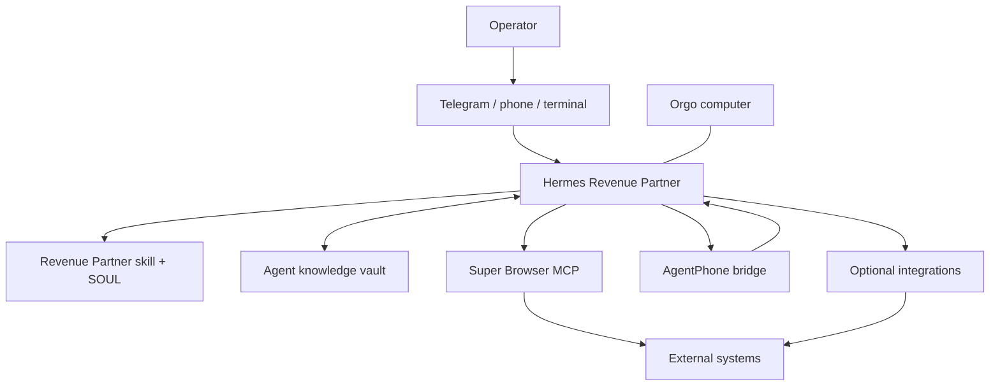

> Legacy custom-template reference. The supported Orgo installation and live verification contract is [the shared walkthrough](../onboarding/GUIDE.md). Do not use the disabled legacy phone bridge for new installs.

# Architecture

## Purpose

Revenue Partner Agent is an operator-facing GTM orchestrator packaged as a Hermes Agent template for an [Orgo](https://orgo.ai?r=aiguy) cloud computer. It coordinates one Money Desk across owned-demand recovery and new-demand acquisition while keeping source claims, customer facts, live results, and production approvals separate.

## System overview

## Core components

### Revenue Partner orchestrator

`files/SOUL.md` and the Revenue Partner skill define:

- fit classification: `fit`, `conditional_fit`, or `not_fit`;
- one canonical offer, ICP, positioning, proof, and approved-claims layer;
- owned-demand and new-demand Money Desk lanes;
- phased channel sequencing;
- separate booked, attended, qualified, opportunity, pipeline, and closed-revenue metrics;
- explicit campaign approval and stop conditions;
- source and uncertainty labeling.

The orchestrator owns shared context and decisions. Narrow specialists may research, score, draft, or report, but do not gain authority merely because they were delegated a task.

### Knowledge vault

`files/agent-knowledge/` seeds an Obsidian-compatible Markdown vault. It stores operator-controlled facts rather than secrets:

- company and offer;
- ICP and fit evidence;
- approved claims;
- Money Desk mapping;
- permissions and priorities;
- campaigns and reports.

Unknown customer facts remain `unknown`, `not_set`, or empty until supplied by the operator.

### Super Browser

The vendored Super Browser package is the browser/research control plane. It exposes eight provider adapters and routes work only after provider readiness, evidence, cost, and policy checks.

Revenue Partner adds a documented downstream safety patch over the pinned upstream revision:

- ad, advert, advertisement, advertising, and campaign objects fail closed to approval;
- narrowly anchored whole-request reads and bounded public-search submissions remain read-only;
- campaign drafting is local Hermes text work, not authority to execute a browser provider;
- mixed read/write or draft/write requests cannot use an early safe exception;
- low-level adapters validate structured, fingerprint-bound approval.

See `files/local-packages/super-browser/LOCAL_PATCHES.md` and `UPSTREAM_SOURCE.md`.

### AgentPhone bridge

The inbound phone bridge is deny-all until a sender is explicitly allowlisted. It does not inherit a broad or full-tool mode. Enabled Hermes toolsets are clamped to read-only `web` and `vision` lanes. Production actions must return to the primary operator channel for approval.

Local outbound attachments are confined to an operator-owned generated-media directory. The bridge rejects arbitrary absolute paths, traversal, final-file symlinks, nested-directory symlink escapes, files outside that root, and a symlinked cache root before opening approved files with `O_NOFOLLOW`; the cache directory is mode `0700` and cached copies are mode `0600`.

### Runtime environment bridge

`files/safe-env-bridge.py` handles allowlisted environment values without sourcing dotenv files as shell code. It:

- parses only allowlisted keys;
- never evaluates shell expressions;
- serializes values safely;
- writes atomically;
- enforces mode `0600`;
- can execute a target argv directly with `os.execvpe`.

### Template builder

`build_template.py` assembles a curated payload, validates the local JSON Schema, and orchestrates operation-specific lifecycle requests without receiving `ORGO_API_KEY`. Authenticated commands enter through `release_entry.py`, which forks an isolated broker retaining the key and execs the builder without it. The broker independently verifies signed current bytes and one-use operation intent before constructing any authenticated [Orgo](https://orgo.ai?r=aiguy) transport.

Validation and lifecycle calls fail closed. A version collision is an error rather than permission to reuse unknown remote bytes.

## Trust boundaries

| Boundary | Trusted input | Untrusted or unverified input | Control |
|---|---|---|---|
| Operator → agent | Explicit customer facts and approvals | Ambiguous instructions | Ask or fail closed |
| Sources → claims | Captured landing page/video evidence | Marketing statements as independent proof | Source ledger and claim labels |
| Agent → browser/provider | Policy-classified read-only local scope | Draft wording, generic intent, or approval records presented as authority | Runtime policy recomputation and adapter hard stops |
| Phone → agent | Allowlisted sender | Unknown sender | Deny-all bridge |
| Environment → process | Allowlisted parsed keys | Shell syntax and unmanaged keys | Safe environment bridge |
| Template → [Orgo](https://orgo.ai?r=aiguy) | Locally or remotely schema-validated payload | Unvalidated or collided version | Fail-closed builder |

## Data flow

1. The operator populates company, offer, ICP, proof, permissions, and source-of-truth rules.
2. The agent assesses fit and maps owned/new demand.
3. Read-only research and local drafting produce evidence-bearing artifacts.
4. Production work is represented as a written campaign contract.
5. The operator approves audience, sender, claims, volume, schedule, budget, suppression, CRM mapping, and stop bounds.
6. Enforced browser/phone paths stop at `awaiting_approval`; local production approval/execution is disabled and any activation requires an operator-reviewed external integration plus a rebuilt release.
7. Results are recorded separately from source claims and recommendations.
8. Weekly reporting recommends continue, modify, pause, or stop.

## Extension rules

When adding a provider, channel, or bridge:

1. Keep credentials outside Git and the golden image.
2. Add a readiness check and explicit failure mode.
3. Define whether the integration enforces approval in code or relies on operator/tool permissions.
4. Test read-only, production, mixed-intent, expired-approval, and retry behavior.
5. Update the source/security/verification documentation.
6. Bump the immutable template version before publication.